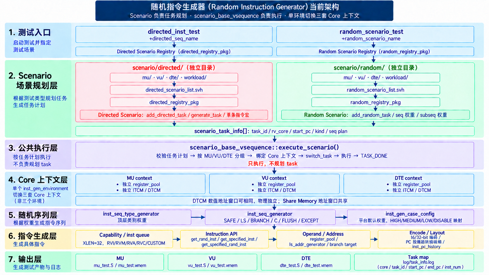
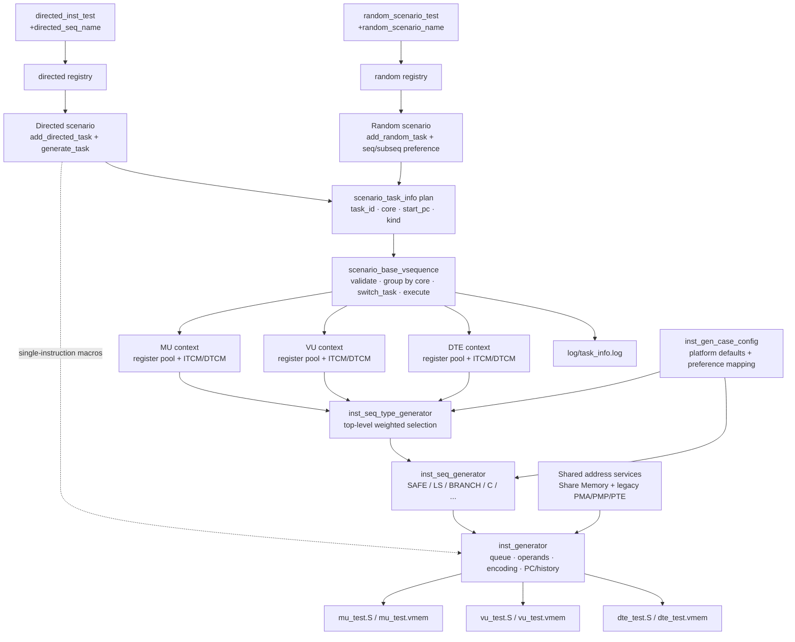

# Instruction Generator Architecture

## Responsibility

Describe the stable boundaries and data/control flow of `st/pre_sim/generator/inst_generator`. Use this document for changes spanning more than one generator subsystem.

## Current Architecture

The scenario is the only task planner; `scenario_base_vsequence` is the common executor. Random and directed scenarios use separate registries but the same base scenario and executor. Directed scenarios can use the shorthand macros in `inst_gen_define.svh`: integer and custom macros accept explicit operands, while `c_*` macros select an exact compressed instruction class and retain that class's legal operand randomization.

The environment still contains one set of generator components. Execution switches among three per-core contexts rather than constructing three independent environments. Each used core receives a distinct `register_pool`; tasks on the same core reuse it. MU, VU and DTE have physically independent ITCM/DTCM instances and may use the same numeric address window. Share Memory uses one common address window. Static generation is grouped MU, VU, then DTE rather than original task-plan order across cores.

`inst_generator` creates one queue of enabled instruction objects, selects/encodes individual instructions, tracks true instruction boundaries, and writes mixed-width output. No scoreboard, covergroup, or feedback-driven generation loop was found in the analyzed generator tree. Generation is constraint/weight driven and produces files; downstream execution/checking is outside this component (`Needs Confirmation` at repository integration level).

## Key Files

- `st/pre_sim/generator/inst_generator/uvm_tb/inst_gen_environment.sv` — constructs and connects components.
- `st/pre_sim/generator/inst_generator/uvm_tb/vseq/scenario_base_vsequence.sv` — scenario selection and common task executor.
- `st/pre_sim/generator/inst_generator/uvm_tb/scenario_seq/scenario_base_seq.sv` — scenario/task planning API.
- `st/pre_sim/generator/inst_generator/uvm_tb/inst_gen/inst_generator.sv` — queue, instruction APIs, PC and output.
- `st/pre_sim/generator/inst_generator/uvm_tb/inst_gen/inst_gen_define.svh` — directed single-instruction macro facade.
- `st/pre_sim/generator/inst_generator/uvm_tb/inst_seq_gen/inst_seq_generator.sv` — sequence-category dispatcher.

## Key Classes / Packages

- `inst_gen_pkg`: instruction definitions, address/register helpers, `inst_generator`.
- `inst_seq_type_pkg`: sequence category enum, weights, selector.
- `inst_seq_pkg`: concrete instruction sequences.
- `scenario_seq_pkg`: scenario and task API.
- `directed_registry_pkg`, `random_registry_pkg`: named scenario factories.
- `inst_gen_env_pkg`: configuration, environment, virtual sequencer and vsequences.
- `tc_pkg`: UVM tests.

## Important Interfaces

- Scenario planning: `add_directed_task`, `add_random_task`, `add_task_seq`.
- Scenario preferences: `set_task_seq_weight`, `set_task_subseq_weight`.
- Directed content: `scenario_base_seq::generate_task` and the macros in `inst_gen_define.svh`.
- Individual instruction: `get_specified_inst`, `get_specified_rand_inst`, `get_rand_inst`.
- Sequence execution: `inst_seq_generator::rand_seq`.
- Task/core execution: `scenario_base_vsequence::execute_scenario`.

## Dependencies

Package order is strict: CPU enums → instruction generator → sequence type → sequences → scenario API → registries → environment → testcase → top. See `build_dependency.md`.

## Current Status

- Default ISA configuration is XLEN=32 with RVI/RVM/RVA/RVC/CUSTOM.
- Random and directed scenario cases compile and run through the shared executor.
- Directed scenarios use public single-instruction macros for integer, C and custom instruction requests.
- Per-core assembly/vmem and a global task map are emitted.
- Mixed 16/32-bit instruction PC/output support is present.

## Known Limitations

- Legacy `task_info_config` still exists for non-scenario flows; scenario flows use `scenario_task_info`.
- Scenario overlap validation checks task-ID uniqueness and 2-byte alignment, but not address-range overlap.
- Capability names still include legacy `RV64*` entries alongside newer generic RVI/RVM/RVA/RVC names.
- C single-instruction macros fix the instruction name but do not yet provide a deterministic compressed-operand encoder.
- Coverage/feedback behavior is not implemented in this generator tree; repository-level consumers need confirmation.

## Recommended Read Scope

### Change component responsibility or end-to-end flow

Read:

1. `uvm_tb/inst_gen_environment.sv`
2. `uvm_tb/vseq/scenario_base_vsequence.sv`
3. `uvm_tb/scenario_seq/scenario_base_seq.sv`
4. The one affected generator/sequence entry point

### Change output ownership or per-core state

Read:

1. `uvm_tb/vseq/scenario_base_vsequence.sv`
2. `uvm_tb/inst_gen/inst_generator.sv`
3. `uvm_tb/inst_gen/register_pool.sv` only for register-state changes

## Do Not Read By Default

Do not read every instruction class, address-translation implementation, all scenarios, all testcase lists, or unrelated RTL for an architecture discussion.

## Expansion Conditions

- Read instruction classes only when an instruction API/encoding changes.
- Read LS/branch internals only when shared PC, register, or address state changes.
- Read filelists/tests only when a public package/interface or validation entry changes.
- Read downstream RTL/checking only to establish an explicit generator-consumer contract.

## Last Verified

Repository state: commit `4723233`, dirty working tree, analyzed 2026-09-10.

Verified areas: environment wiring, scenario/task executor, generator/sequence boundaries, package order, current default ISA, directed macro API.

Needs re-verification if scenario execution, environment composition, output format, package ownership, or single-instruction macro behavior changes.
