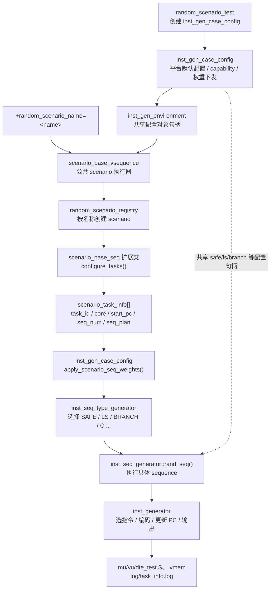

# Random Scenario 使用说明

本文档描述当前代码已经实现的 random scenario 架构和公开接口。Scenario 是 task 规划层；它不直接操作生成器组件，也不填写底层百分比权重。

## 1. 当前架构



真实调用顺序：

```text
random_scenario_test
  -> scenario_base_vsequence::select_scenario()
  -> random_scenario_registry.get(random_scenario_name)
  -> scenario.configure_tasks()
  -> scenario_base_vsequence::execute_scenario()
       -> 按 MU / VU / DTE 分组
       -> switch_task(task_id, start_pc)
       -> inst_gen_case_config.apply_scenario_seq_weights(task_info)
       -> inst_seq_type_generator.get_seq_type()
       -> inst_seq_generator.rand_seq(seq_type)
       -> inst_generator 输出指令
       -> TASK_DONE 结束当前 task
```

## 2. Scenario 当前可以配置什么

每个随机 task 通过 `add_random_task()`配置：

```systemverilog
task_id = add_random_task(.rv_core(HART_MU),
                          .use_start_pc(1'b1),
                          .start_pc('h0));
```

| 参数 | 含义 |
| --- | --- |
| `task_id` | 可省略；由 `scenario_base_seq` 在 `0..15` 内随机分配，并保证当前 plan 内唯一 |
| `rv_core` | `HART_MU`、`HART_VU`或 `HART_DTE` |
| `seq_num` | 可省略；执行时使用 `inst_gen_case_config.seq_num` 的随机值，`+seq_num=<N>` 可覆盖 |
| `use_start_pc` | `1`表示使用指定 PC；`0`表示接续该 core 当前 PC |
| `start_pc` | 指定起始 PC，必须按 2 字节对齐 |

所有现有 Random Scenario 使用 `random_task_num()` 获取 task 数量：默认在 `1..8` 内随机，`+scenario_task_num=<N>` 可统一覆盖。

每个随机 task 还可以通过 `set_task_seq_weight()`配置顶层 sequence 偏好：

```systemverilog
set_task_seq_weight(task_id, seq_type, weight);
```

当前支持的 `seq_type`：

| Sequence 类型 | 生成内容 | 生效条件 |
| --- | --- | --- |
| `SAFE_INST_SEQ` | 普通安全计算指令流 | SAFE sequence 未关闭 |
| `LS_INST_SEQ` | load/store/AMO 等访存指令流 | LS sequence 未关闭 |
| `BRANCH_INST_SEQ` | branch/jump/loop 指令流 | BRANCH sequence 未关闭 |
| `C_INST_SEQ` | 压缩指令流 | `support_inst_set`包含 `RVC` |
| `FLUSH_INST_SEQ` | flush 指令流 | 平台开启 flush sequence |
| `EXCEPT_INST_SEQ` | exception 指令流 | 平台开启 exception sequence |

Scenario 还可以配置 SAFE、LS、BRANCH 的直接下一层选择。更深层的 load/store/AMO、目标范围及 BLT/自定义 LOOP 权重仍由底层配置对象管理。

## 3. 权重怎么配置

Scenario 使用四档枚举，不填写数字或百分比：

| 枚举 | 含义 | `inst_gen_case_config`内部相对值 |
| --- | --- | --- |
| `WEIGHT_DISABLE` | 不选择 | 0 |
| `WEIGHT_LOW` | 低偏好 | 1 |
| `WEIGHT_MEDIUM` | 中等偏好 | 4 |
| `WEIGHT_HIGH` | 高偏好 | 10 |

例如：

```systemverilog
set_task_seq_weight(100, SAFE_INST_SEQ,   WEIGHT_HIGH);
set_task_seq_weight(100, LS_INST_SEQ,     WEIGHT_MEDIUM);
set_task_seq_weight(100, BRANCH_INST_SEQ, WEIGHT_LOW);
set_task_seq_weight(100, C_INST_SEQ,      WEIGHT_LOW);
```

场景表达的是相对偏好，不保证有限样本的实际数量严格等于某个比例。

配置规则：

- 同一个 task 的同一种 `seq_type`只能配置一次；
- 未列出的类型保留平台随机默认权重；
- 只有 `WEIGHT_DISABLE` 会把对应类型的权重置为 0；
- 所有类型都为 `WEIGHT_DISABLE`会触发 `UVM_FATAL`；
- 请求平台未开启的非零类型会触发 `UVM_FATAL`；
- 每个 task 开始前先恢复平台默认值，再应用该 task 的权重，不会继承前一个 task 的 PLAN；
- 权重转换和 capability 检查均在 `inst_gen_case_config`完成，生成器组件通过现有共享配置句柄看到结果。

## 4. AUTO 和 PLAN

### 下一层权重

可以直接配置父类型的子选择器；若父类型已显式 `WEIGHT_DISABLE`，则不能再配置它的子类型：

```systemverilog
set_task_subseq_weight(task_id, seq_type, subseq_type, weight);

set_task_subseq_weight(100, BRANCH_INST_SEQ,
                       SCENARIO_BRANCH_SINGLE, WEIGHT_HIGH);
set_task_subseq_weight(100, BRANCH_INST_SEQ,
                       SCENARIO_BRANCH_LOOP, WEIGHT_LOW);
```

| 父类型 | 子类型 |
| --- | --- |
| `SAFE_INST_SEQ` | `SCENARIO_SAFE_INT_CAL`、`SCENARIO_SAFE_FLOAT_CAL`、`SCENARIO_SAFE_BRANCH`、`SCENARIO_SAFE_INT_LS`、`SCENARIO_SAFE_CUSTOM_DSA` |
| `LS_INST_SEQ` | `SCENARIO_LS_RAND`、`SCENARIO_LS_LINEAR`、`SCENARIO_LS_MEMCPY` |
| `BRANCH_INST_SEQ` | `SCENARIO_BRANCH_SINGLE`、`SCENARIO_BRANCH_LOOP`、`SCENARIO_BRANCH_JALR` |

每个 task 开始时先恢复平台随机默认值。未配置的子类型继续按默认权重随机；显式 `WEIGHT_DISABLE` 才关闭，LOW/MEDIUM/HIGH 才覆盖默认偏好。父类型被显式关闭、父子类型不匹配、重复配置，或者显式配置后导致该父类型全部有效子权重为 0，都会触发 `UVM_FATAL`。

### AUTO

只调用 `add_random_task()`，没有调用 `set_task_seq_weight()`：

```systemverilog
add_random_task(100, HART_MU, 20, 1'b1, 'h0);
```

此时 `seq_select_mode`保持 `SCENARIO_SEQ_AUTO`，使用 `inst_gen_case_config.inst_seq_type_cfg`的原有平台默认权重。

### PLAN

只要调用一次 `set_task_seq_weight()`，该 task 就进入 `SCENARIO_SEQ_PLAN`：

```systemverilog
add_random_task(100, HART_MU, 20, 1'b1, 'h0);
set_task_seq_weight(100, SAFE_INST_SEQ, WEIGHT_HIGH);
set_task_seq_weight(100, LS_INST_SEQ,   WEIGHT_LOW);
```

该 task 会提高 SAFE、降低 LS；其他未配置类型仍按平台默认权重参与。AUTO 和 PLAN 最终都调用同一个 `inst_seq_type_generator::get_seq_type()`，PLAN 不再由 vsequence 自己实现一套随机算法。

## 5. 完整 Scenario 示例

```systemverilog
class mu_example_random_scenario_seq extends scenario_base_seq;
    `uvm_object_utils(mu_example_random_scenario_seq)

    function new(string name = "mu_example_random_scenario_seq");
        super.new(name);
    endfunction

    virtual function void configure_tasks();
        // task 100：从 PC=0 开始，偏向 SAFE。
        add_random_task(100, HART_MU, 20, 1'b1, 'h0000);
        set_task_seq_weight(100, SAFE_INST_SEQ, WEIGHT_HIGH);
        set_task_seq_weight(100, LS_INST_SEQ,   WEIGHT_LOW);

        // task 101：显式从 PC=0x1000 开始，只产生 C sequence。
        add_random_task(101, HART_MU, 10, 1'b1, 'h1000);
        set_task_seq_weight(101, C_INST_SEQ, WEIGHT_HIGH);

        // task 200：VU task，不指定 PC，接续 VU 当前指令流地址。
        add_random_task(200, HART_VU, 10, 1'b0, '0);
        set_task_seq_weight(200, SAFE_INST_SEQ, WEIGHT_MEDIUM);
    endfunction
endclass

`RANDOM_SCENARIO_REGISTER(mu_example_random_scenario_seq, "mu_example_random")
```

Task 规则：

- task ID 由 scenario 编写者保证全局唯一；
- 显式 start PC 的地址空间是否重叠由 scenario 编写者保证；
- 同一 core 的多个 task 共享该 core 的 register pool；
- 不同 core 使用独立 register pool；
- 普通 LS 地址由 `ls_addr_generator`按当前 hart 生成：三个 Core 的 DTCM 物理独立但可使用相同地址窗口，Share Memory 地址窗口共享；旧 `addr_space_generator`仍作为公共 PMA/PMP/PTE/异常地址服务保留；
- 静态生成按 MU、VU、DTE 分组执行，因此跨 core 的执行顺序不是 task 添加顺序。

## 6. 当前已有 Random Scenario

当前 `scenario/random/random_scenario_list.svh`注册了：

| Registry 名称 | 文件 | 配置 |
| --- | --- | --- |
| `mu_random` | `mu/mu_random_scenario_seq.sv` | 不覆盖顶层权重，使用平台默认随机类型 |
| `mu_safe_random` | `mu/mu_safe_random_scenario_seq.sv` | 仅 SAFE |
| `mu_branch_random` | `mu/mu_branch_random_scenario_seq.sv` | 仅 BRANCH |
| `mu_c_random` | `mu/mu_c_random_scenario_seq.sv` | 仅 C |
| `mu_ls_random` | `mu/mu_ls_random_scenario_seq.sv` | 仅 LS |

## 7. 新增并运行 Scenario

1. 在 `scenario/random/<core>/`下创建扩展自 `scenario_base_seq`的类。
2. 在 `configure_tasks()`中添加 task 和权重。
3. 使用 `RANDOM_SCENARIO_REGISTER`注册名称。
4. 在 `scenario/random/random_scenario_list.svh`中 include 新文件。
5. 在 `rsim/case_lst/random.lst`中增加 case。

Case 示例：

```text
- case_name      = mu_example_random_scenario_test
  uvm_tc         = random_scenario_test
  vcs_tb_args    = +random_scenario_name=mu_example_random+test_mode=INT_TEST
  batch_times    = 1
```

运行：

```csh
cd /fastone/users/yi.tian/work/dv_bachcore/st/pre_sim/generator/inst_generator/rsim
single case=mu_example_random_scenario_test lst=random.lst seed=1 uvm=UVM_LOW
```

## 8. Plusarg

公共选择参数：

| Plusarg | 含义 |
| --- | --- |
| `+random_scenario_name=<name>` | 从 random registry 选择 scenario；随机 case 必填 |
| `+test_mode=INT_TEST` | 配置测试模式，现有 MU random case 使用此值 |
| `+xlen=32`或 `+xlen=64` | 覆盖平台默认 XLEN；当前默认是 32 |

公共 Random Scenario task 数量参数：

| Plusarg | 含义 | 限制 |
| --- | --- | --- |
| `+scenario_task_num=<N>` | scenario 创建的 task 数量 | `1..8` |

未传 `+scenario_task_num` 时，`scenario_base_seq::random_task_num()` 在 `1..8` 内随机。现有 5 个 MU Random Scenario 均调用该接口。它们不读取 `+scenario_seq_num`；公共 `+seq_num=<N>` 负责覆盖 `inst_gen_case_config.seq_num`。

## 9. 日志和输出

在 `UVM_LOW`下检查：

```text
[SCENARIO_WEIGHT]
task_id=100 seq_type=SAFE_INST_SEQ preference=WEIGHT_HIGH runtime_weight=10
```

这表示 scenario 配置已经通过 `inst_gen_case_config`下发。

```text
[SCENARIO_SEQ_RESULT]
task_id=100 seq_type=SAFE_INST_SEQ preference=WEIGHT_HIGH selected=24/30
```

这表示该类型实际被选择的次数。

仿真目录 `rsim/sim_single/`中的主要产物：

- `mu_test.S`、`mu_test.vmem`；
- `vu_test.S`、`vu_test.vmem`；
- `dte_test.S`、`dte_test.vmem`；
- `log/task_info.log`：task ID、core、start/end PC、指令数；
- `log/inst_seq.log`：每段 sequence 信息；
- `sim.log`：UVM 日志。

未使用 core 的 `.S/.vmem`会被创建为空文件，避免误用上一次仿真的旧产物。

## 10. 与 Directed Scenario 的边界

Random 和 directed scenario 共用 `scenario_base_vsequence`执行器，但入口和 registry 独立：

- Random：`+random_scenario_name=<name>`；
- Directed：`+directed_seq_name=<name>`。

两个参数不能同时使用。Directed task 调用 scenario 的 `generate_task()`，不会应用 random task 权重；执行前会恢复平台默认 sequence 权重，避免受到此前 random task 的配置影响。
